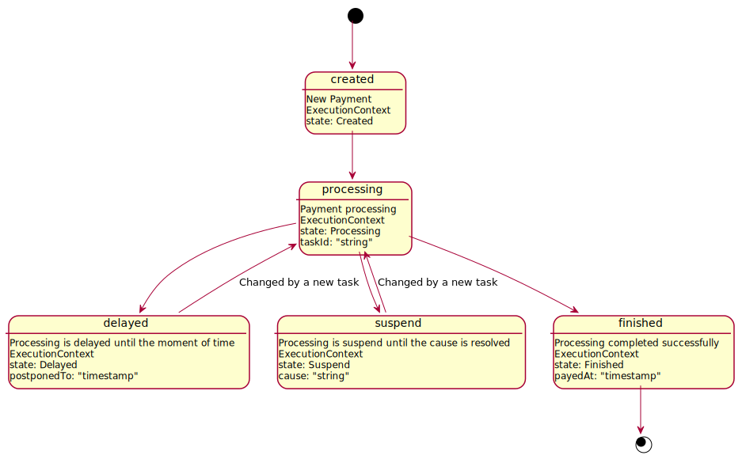

# Implementation details
* Mongodb is used as a database. The database name is "govfee".
* RabbitMQ is used as a message queue. The processing queue name is "govfee.payment".

## HTTP request processing

## Payment processing
### Processing flow

### Execution context switching

## Payment processing

# TODO
* threshold for resuming payment (state=suspend|delayed)