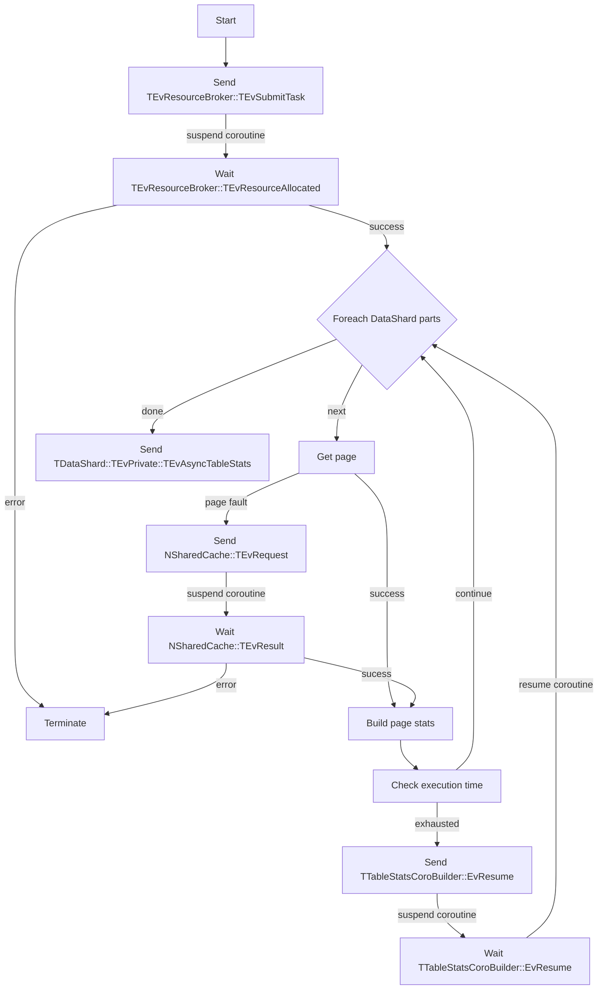

## Детали реализации
Вместо TAsyncTableStatsBuilder
``` C++
class TAsyncTableStatsBuilder : public TActorBootstrapped<TAsyncTableStatsBuilder>
```
определяем корутинный актор TTableStatsCoroBuilder
``` C++
class TTableStatsCoroBuilder : public TActorCoroImpl, IPages 
``` 

Реализуемый интерфейс IPages, при вызове метода TryGetPage не будет генерировать page fault. Если страница отсутствует в локальной коллекции, происходит отправка события NSharedCache::TEvRequest и приостановка корутины до получения события NSharedCache::TEvResult.\
Все подгруженные страницы, как и прежде хранятся в локальной коллекции.\
После обработки каждого TPart, проверяем продолжительность работы корутины. В случае превышения некоторого значения, прерываем выполнение корутины путем отправки себе сообщения и ожидания его получения.\
Расширяем интерфейс метода построения статистики BuildStats для проверки времени работы корутины. Добавим функтор в аргументы метода, при вызове которого будем проверять продолжительность выполнения корутины: start - now. В случае превышения допустимого времени, отправляем себе событие TTableStatsCoroBuilder::EvResume и прерываем корутину до момента его получения.\
За начало времени работы корутины будем считать время возобновления исполнения корутины или начала работы актора.

### Схема работы актора

